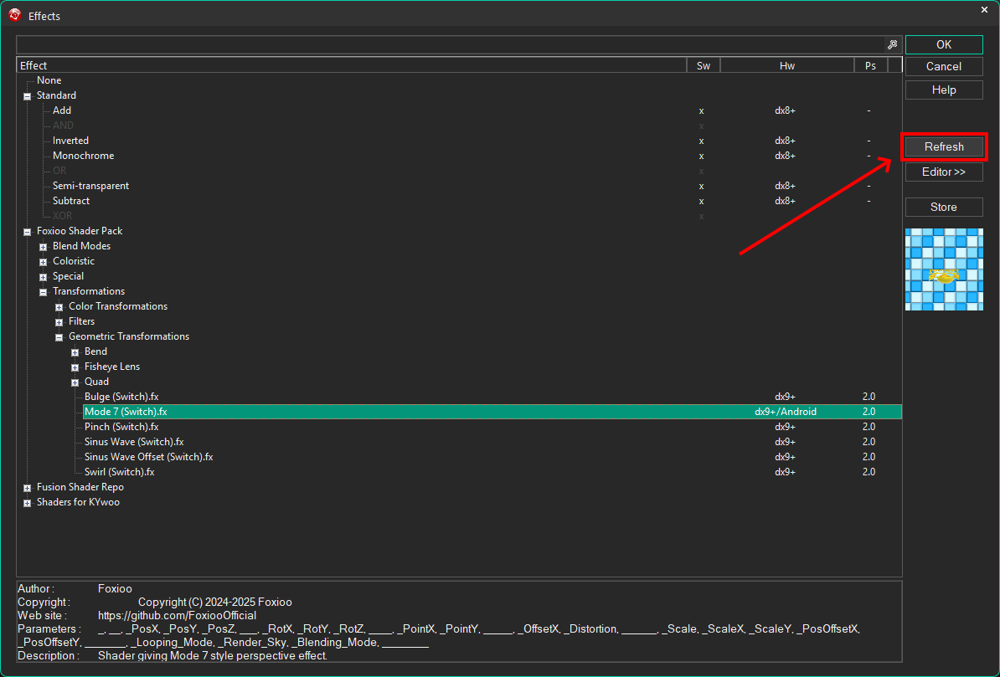
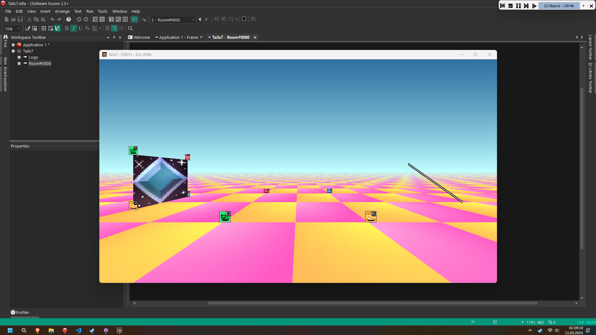

  

  <h2>Mode7 engine for Clickteam Fusion</h2>

  | <a href="https://github.com/FoxiooOfficial/FoxiooShaderPack/issues" class="_LinkButton">`⚠️ Report Bug`</a> | **`Release: R1.0.1_10.05.25a`** | **`Edit description from: 11.05.25`** | **`License: MIT`** |

## 📚 Table of contents
- [About](#-about)
- [Installation](#-installation)
- [Reports And Ideas](#-reports-and-ideas)
- [License](#-license)

## 🦊 About

**Tails7 is a Mode7-style engine for Clickteam Fusion.** It does not use additional extensions and works by reversing calculations from the shader.

- The engine is designed to handle multiple modes as it needs to map the object, scale, display on the screen and more.
- Very easy to use and has many tutorials and <a href="https://foxioo.itch.io/tails7examples">**✨special examples✨**</a>.

ℹ️ This is my first so advanced project, for any inadequacies and errors please report it and I will try to fix it.

💝 I would like to sincerely thank them because the project would not work out:
- Sketchy / MuddyMole
- Linky
- Glace Sue
- Clickteam

## 📝 Requirements

<b>This project requires the following:</b>

    <ul>
                <li><b>Clickteam Fusion 2.5</b> <i>(Build 295.10 or later)</i><b>:</b> <a href="https://www.clickteam.com/clickteam-fusion-2-5">Link</a> or <a href="https://store.steampowered.com/app/248170/Clickteam_Fusion_25/">Link for Steam version</a></li>
                <li><b>Clickteam Fusion 2.5+ DLC:</b> <a href="https://www.clickteam.com/clickteam-fusion-2-5-plus">Link</a> or <a href="https://store.steampowered.com/app/1056780/Clickteam_Fusion_25_Addon/">Link for Steam version</a></li>
                <li><b>Hardware that meets the minimum requirements with Clickteam Fusion.</b></li>
                <li><b>Device that supports Direct3D9 or Direct3D11 shaders.</b></li>
  </ul>

## 💿 Installation

1. Press **Code** -> **Download ZIP**.

2. Extract the ZIP file of the project

3. In Clickteam Fusion, go to **Tools** -> **Windows Explorer**.

4. From the Tails7 folder, go to **Shader** and copy the **Foxioo Shader Pack** folder to Clickteam Fusion Effects folder.

5. in Clickteam Fusion refresh the effects list, there should be a folder **Foxioo Shader Pack**.

*(There are only 4 shaders in this Repo, don't notice that there are many more in the screenshot)*

6. Run **Tails7.mfa** in Clickteam Fusion and compile the program

## ❗ Reports And Ideas

🔴 **Issue topic:**

Please report <a href="https://github.com/FoxiooOfficial/Tails7/issues">here</a>, they will be checked on an ongoing basis and attempts will be made to fix them.

*(These bugs will be recorded in the notebook **Bug Tracker.xlsx**)*

🟢 **Ideas topic:**

 Also report <a href="https://github.com/FoxiooOfficial/Tails7/issues?q=is%3Aissue%20state%3Aopen%20label%3Aidea">here</a>, however, with the topic remember to add the appropriate tag!

## 📑 License

**The whole thing is based on MIT License**

- ✅ You can modify the code and distribute it as you like.
- ⚠️ However, you must specify me (**Foxioo**) in the credits.
